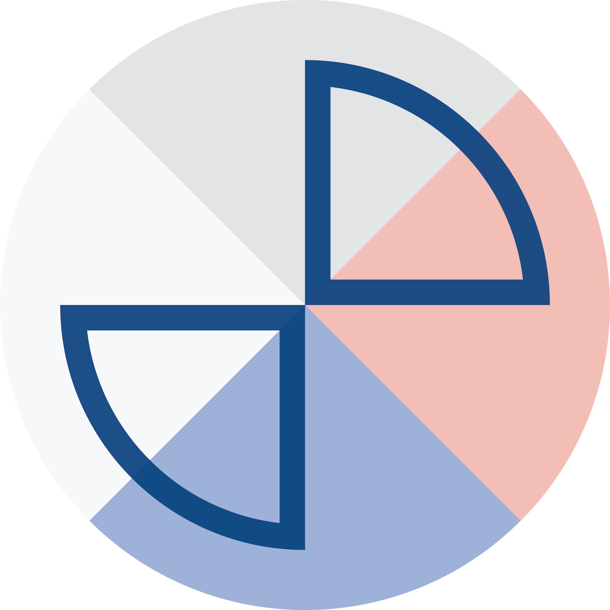

  

# Groundlens

**Geometric methods for trustworthy models — verification over capability.**

---

## Mission

**We turn "trust me" into "check me."**

I built Groundlens because "trust me" is not an answer when the stakes are real. So it does one thing, cheaply and the same way every time: it tells you whether a machine's answer actually came from the source it was supposed to use.

It reads the geometry of the answer, not a second model's opinion, so the clear cases pass in milliseconds and only the doubtful ones cost you a person or a heavier check.

And it names, out loud, the cases it cannot see. Saying what it misses is not a footnote. It is the point.

## Vision

A world where trusting a machine's answer stops being an act of faith.

Where under every answer sits a deterministic check you own — one you can run again two years later, show a supervisor, and get the same result. Not a black box grading another black box.

A verification floor that runs on everything you ship, so *"did this come from the source?"* becomes something you prove, not something you hope.

---

## Projects

### Groundlens

The deterministic first stage for RAG and agent loops. It ranks responses by how faithfully they reflect their sources — deterministic scores, sub-second, no second LLM in the loop — so the answers that earned trust pass and the rest go to review. It decides what your expensive check has to look at.

### Groundlens-MCP

The same first-stage check inside Claude Desktop, Cursor, Windsurf, and any MCP client. It prints a reading under each answer — did this come from its source? — in milliseconds, with no model in the scoring path. It is a filter, not a judge, and every check says so.

### Grounding-Benchmark

Almost every hallucination benchmark writes its false answers by prompting an LLM. This one does not — a person writes them from memory, producing confabulations that stay inside the register of a correct answer. That is exactly where embedding-similarity detectors fall to chance. The evidence base for what these methods actually measure.

### Neural Dimensionality Tracker (NDT)

High-frequency monitoring of how a network's internal representations evolve during training, flagging discrete phase transitions. The same DNA as Groundlens: read the geometry of representations to see what a model is actually doing. Three lines to instrument any PyTorch model.

---

## Research

Groundlens is built on peer-reviewed research.

| Year | Publication | Link |
|---|---|---|
| 2026 | Rotational Dynamics of Factual Constraint Processing | [arXiv:2603.13259](https://arxiv.org/abs/2603.13259) |
| 2026 | A Geometric Taxonomy of Hallucinations in LLMs | [arXiv:2602.13224](https://arxiv.org/abs/2602.13224) |
| 2025 | Semantic Grounding Index (SGI) | [arXiv:2512.13771](https://arxiv.org/abs/2512.13771) |

---

## Contributing

Contributions are welcome across every Groundlens repository. Read [CONTRIBUTING.md](CONTRIBUTING.md) before opening an issue or a pull request.

## License

All Groundlens open-source projects are released under **Apache 2.0**. See [LICENSE](LICENSE).

## About

Groundlens is an independent open-source practice for trustworthy modeling, working where applied geometry meets machine learning. Maintained by [Javier Marin](https://www.linkedin.com/in/javiermarinvalenzuela/) · [javier@groundlens.dev](mailto:javier@groundlens.dev) · [groundlens.dev](https://groundlens.dev)
