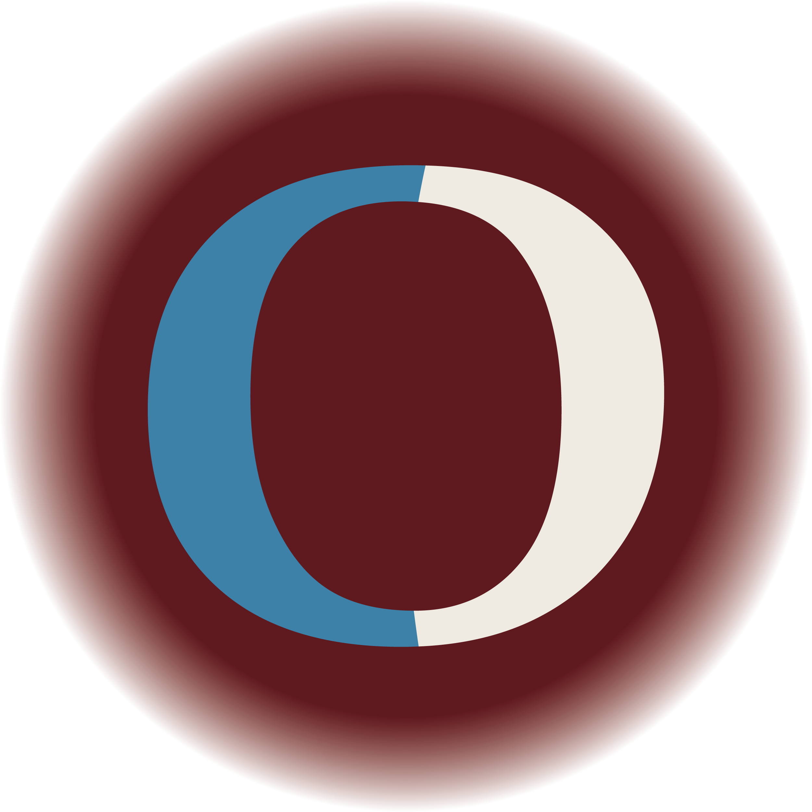
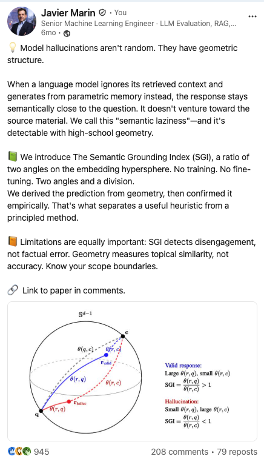

<div align="center">
  
# Groundlens dev: Geometric methods for trustworthy models

</div>

<p>
An open-source practice for <b>trustworthy modeling</b> — making the outputs of both AI systems and physical systems verifiable.<br>
</p>

[](https://groundlens.dev)
[](https://huggingface.co/spaces/groundlens/demo)
[](https://scholar.google.es/citations?user=cqDaAlEAAAAJ&hl=es)
[](LICENSE)

<br>

**[Mission](#mission) · [Groundlens](#groundlens) · [Otwin](#otwin) · [Tools](#tools) · [Research lines](#research-lines) · [Featured](#featured) · [Publications](#publications) · [About](#about)**

</div>

---
## Mission

<div align="center">
  
*We turn "trust me" into "check me."*

</div>

AI is fluent, and fluency hides error. A language model that sounds right and a black-box predictor that fits the data can both be confidently wrong — and neither can prove otherwise. Groundlens builds the layer that checks: every claim measured against ground truth you can inspect — the source it cited, the physics it must obey, the geometry of its own representations. No second opaque model casting a vote. Deterministic, reproducible, the same verdict every time.

If it can't be verified, it can't be trusted. So we make it verifiable.

## Projects

- **Groundlens** — verifies **what a language model says**, using the geometry of embeddings.
- **Otwin** — models **how a physical system behaves**, using the geometry of energy (port-Hamiltonian structure) with calibrated uncertainty.

Both are MIT-licensed and built to be auditable.

<br>

<div align="center">
  


## Groundlens

</div>

### LLM output verification - Geometric hallucination detection

Geometric grounding and hallucination triage for production LLMs in regulated industries. It ranks responses by how faithfully they reflect their sources — **deterministic scores, sub-second, no second LLM in the loop** — so the ones that earned trust pass and the rest go to human review.

<div align="center">

[](https://huggingface.co/spaces/groundlens/demo)

<sub>Run grounding verification in your browser — no install.</sub>

</div>

[](https://github.com/groundlens-dev/groundlens)
&nbsp;[](https://github.com/groundlens-dev/groundlens/stargazers)

[`groundlens`](https://github.com/groundlens-dev/groundlens) · [`grounding-benchmark`](https://github.com/groundlens-dev/grounding-benchmark) · [`groundlens-mcp`](https://github.com/groundlens-dev/groundlens-mcp) · [`Groundlens-Cookbook`](https://github.com/groundlens-dev/Groundlens-Cookbook)

### Groundlens research

The methods are not heuristics — they come from published work.

| Paper | Idea | Link |
|---|---|---|
| **Semantic Grounding Index (SGI)** | Ratio-based grounding verification for RAG — measures whether a response engages its source via angular geometry on the unit hypersphere. | [](https://arxiv.org/abs/2512.13771) |
| **A Geometric Taxonomy of Hallucinations** | Three-type hallucination classification via directional grounding (von Mises–Fisher on displacement vectors); domain calibration reaches AUROC 0.76–0.99. | [](https://arxiv.org/abs/2602.13224) |
| **Rotational Dynamics of Factual Constraint Processing** | Transformers reject wrong answers by *rotating* the representation, not rescaling — with a phase transition at ~1.6B parameters. | [](https://arxiv.org/abs/2603.13259) |

<br>

<div align="center">
  


## Otwin

</div>

### Physics-informed digital twins- IEEE PES General Meeting 2026

Digital twins with **calibrated uncertainty** for grid-scale energy storage and other physical systems. You bring the physical *model structure* you know (a port-Hamiltonian system, or an empirical law); Otwin estimates the rest from data, attaches horizon-aware uncertainty intervals, and validates without leakage against mandatory baselines. Lightweight and CPU-first, spanning **white-box** (full physics) to **grey-box** (physics + estimated residual).

[](https://github.com/groundlens-dev/otwin)
&nbsp;[](https://github.com/groundlens-dev/otwin/stargazers)
&nbsp;Presented at **IEEE PES General Meeting 2026** — *AI-powered Digital Twins for Grid-Scale Storage*.

| Problem | Result |
|---|---|
| **Water tank** · first-principles (white-box). A draining tank written as a port-Hamiltonian system — can a structure-preserving forecast stay physical at any horizon? | <br><sub>Energy decays monotonically (passive by construction); skill ≈ 0.94 vs a persistence baseline.</sub> |
| **DC motor** · first-principles, multi-domain. Coupled electrical + mechanical actuator — can the twin predict it with no fitting? | <br><sub>Numeric steady state matches the closed-form ω, I to within 0.001%.</sub> |
| **Pumped-hydro storage** · white-box, grid-scale. The dominant grid storage technology — how much energy survives a charge/discharge cycle? | <br><sub>Round-trip efficiency matches the closed form η<sub>p</sub>·η<sub>t</sub>; energy conserved while idle.</sub> |
| **Battery State-of-Health** · grey-box. Forecast Li-ion SoH / remaining useful life with trustworthy intervals (predictive maintenance). | <br><sub>The physics-informed hybrid tracks the real decay to end-of-life; a data-only model diverges. The 90% band is calibrated.</sub> |
| **Grid-scale dispatch** · predictive maintenance → real-time optimization. Dispatch storage under uncertain capacity. | <br><sub>The calibrated-UQ plan leaves <b>0.0 MWh</b> of demand unmet over the horizon, vs 55.6 MWh for a naive plan.</sub> |

<br>

## Tools

Smaller, focused utilities that support the projects above.

### ndt — Neural Dimensionality Tracker

High-frequency monitoring of how a neural network's internal representations evolve during training. It tracks representational **dimensionality** across MLPs, CNNs, Transformers and Vision Transformers, and flags discrete phase transitions (jumps) — the same DNA as Groundlens: reading the *geometry of representations* to see what a model is actually doing. Three lines to instrument any PyTorch model.

```bash
pip install ndtracker
```

[](https://github.com/groundlens-dev/ndt)
&nbsp;[](https://github.com/groundlens-dev/ndt/stargazers)
&nbsp;[](https://pypi.org/project/ndtracker/)

<br>

## Research lines

Code-backed research that feeds the projects above — published, with the limits stated.

### hamiltonian-ai — symmetry, invariance, and structure in neural optimization

A symplectic optimizer for out-of-time ranking under class imbalance, phase-space diagnostics that separate valid from invalid LLM reasoning, and a systematic study of where geometric structure stops helping. The same DNA as the rest of Groundlens: read the geometry, state the limits.

[](https://github.com/groundlens-dev/hamiltonian-ai)
&nbsp;[](https://github.com/groundlens-dev/hamiltonian-ai/stargazers)
&nbsp;[](https://arxiv.org/abs/2410.04415)

<br>

## Featured

<div align="center">

<a href="https://www.linkedin.com/feed/update/urn:li:share:7407335601592741888/">
  
</a>

<sub><b>100,000+ impressions</b> · <a href="https://www.linkedin.com/feed/update/urn:li:share:7407335601592741888/">read it on LinkedIn</a></sub>

</div>

<br>

## Publications

Groundlens is built on peer-reviewed research. Selected publications:

| Year | Publication | Venue / link |
|---|---|---|
| 2026 | Rotational Dynamics of Factual Constraint Processing | [arXiv:2603.13259](https://arxiv.org/abs/2603.13259) |
| 2026 | A Geometric Taxonomy of Hallucinations | [arXiv:2602.13224](https://arxiv.org/abs/2602.13224) |
| 2025 | Semantic Grounding Index (SGI) | [arXiv:2512.13771](https://arxiv.org/abs/2512.13771) |
| 2025 | Hamiltonian Neural Networks for Out-of-Time Credit Scoring - accepted (peer-reviewed), IEEE DSAA 2025| [arXiv:2410.10182](https://arxiv.org/abs/2410.10182)|
| 2024 | Optimizing AI Reasoning: A Hamiltonian Dynamics Approach to Multi-Hop QA | [arXiv:2410.04415](https://arxiv.org/abs/2410.04415) |

<div align="center">

[](https://scholar.google.es/citations?user=cqDaAlEAAAAJ&hl=es)

</div>

<br>

## Contributing

Contributions are welcome across all Groundlens repositories. Please read [CONTRIBUTING.md](CONTRIBUTING.md) before opening an issue or pull request.

## Code of Conduct

This community follows the Contributor Covenant. See [CODE_OF_CONDUCT.md](CODE_OF_CONDUCT.md).

## Security

To report a vulnerability, please follow the process in [SECURITY.md](SECURITY.md) — do not open a public issue for security matters.

## License

All Groundlens open-source projects are released under the **MIT License**. See [LICENSE](LICENSE).

## About

**Groundlens** is an independent open-source practice for trustworthy modeling, working at the intersection of applied geometry, physics, and machine learning. Its two lines — Groundlens (LLM verification) and Otwin (physics-informed digital twins) — share a single goal: outputs you can audit before they reach production.

Maintained by [Javier Marin](https://www.linkedin.com/in/javiermarinvalenzuela/) · Madrid · [javier@groundlens.dev](mailto:javier@groundlens.dev) · [groundlens.dev](https://groundlens.dev)

<div align="center">
<br>
<sub>Verification over capability.</sub>
</div>
