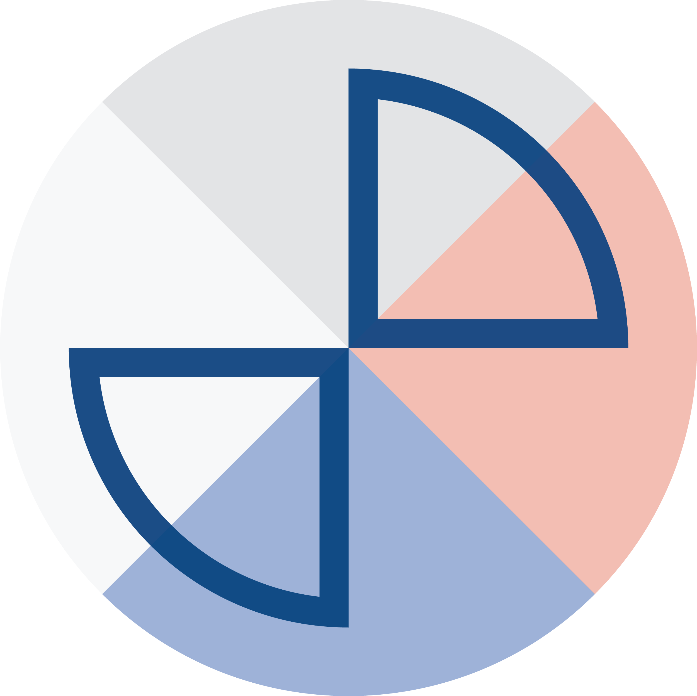

  

# Groundlens: open source tools for verifying the output of language models and agents

## We turn "trust me" into "check me."

"Trust me" is not an answer when the stakes are real.

So these tools do one thing between them: they let you check what a model produced without taking another model's word for it. Some read the geometry of an answer — where it sits relative to the source it was given and the question it was asked. One decides whether an answer may be written into your agent's state, before a bad one contaminates every turn after it. One asks the model again and measures whether it agrees with itself. One checks the answer against a written policy and hands back the sentence that broke it. One fits all of it to your own data, because cut points that came from someone else's corpus are not yours.

They run locally, in milliseconds, with no generative model in the scoring path. Nothing is sampled, so nothing drifts: you can run the same check two years from now, show it to a supervisor, and get the same number. The clear cases pass for almost nothing, and only the doubtful ones cost you a person or a heavier check.

And every one of them names, out loud, what it cannot see. Saying what a method misses is not a footnote — it is most of the value.

## How to use groundlens

- **Want to check whether an answer actually came from the document you gave the model?**
That is [**groundlens**](https://github.com/groundlens-dev/groundlens). Deterministic scores in milliseconds, no second model in the loop, the same result every time. It is the first stage: it decides what your expensive check has to look at. It tells you where an answer came from, not whether it is true — a wrong fact in the right frame will pass.

- **Want that check running while you work, inside Claude Desktop, Cursor or Windsurf?**
[**groundlens-mcp**](https://github.com/groundlens-dev/groundlens-mcp) prints a reading under each answer as it arrives. It is a filter, not a judge, and every reading says so.

- **Have to show a supervisor that an answer followed a policy, with the evidence attached?**
That is the rule sets, and they ship inside [**groundlens**](https://github.com/groundlens-dev/groundlens) — hand-authored checklists that carry the text that triggered them. They are pattern checks, not measurements, and they say so on every result.

- **Want to know what these detectors actually measure, and where they stop working?**
[**grounding-benchmark**](https://github.com/groundlens-dev/grounding-benchmark) writes its false answers by hand rather than prompting a model for them, which is the case similarity-based detection finds hardest. Read the datasheet before quoting a number from it.

- **Want to see the components working together on a real pipeline?**
The [**Cookbook**](https://github.com/groundlens-dev/Groundlens-Cookbook) has executable notebooks: what each check settles, and what it hands on.

- **Curious about our numbers?**
Start with [the benchmarks page](https://docs.groundlens.dev/benchmarks/results/). Every metric ships with its measured ceiling and its failure modes, and earlier figures that did not survive the controls have been withdrawn rather than quietly restated.

- **Want to know the research these methods come from?**
[**Research**](https://github.com/groundlens-dev/groundlens-dev/blob/main/RESEARCH.md) — three arXiv preprints. The geometry is three arccos calls and a division; the interesting part is where it fails.

*If you are checking generated output in a pipeline that matters, and paying for it in tokens or in people, the problem is interesting to us.
Contact: [javier@groundlens.dev](mailto:javier@groundlens.dev).*

## Contributing

Contributions are welcome across every repository. If you think a number here is wrong, open an issue with the reproduction — corrections get fixed and credited in the commit. Read [CONTRIBUTING.md](CONTRIBUTING.md) first.

## License

Everything here is Apache 2.0. See [LICENSE](LICENSE).

## About

Groundlens is an independent open-source practice for trustworthy modeling, working where applied geometry meets machine learning. Maintained by [Javier Marin](https://www.linkedin.com/in/javiermarinvalenzuela/) · [javier@groundlens.dev](mailto:javier@groundlens.dev) · [groundlens.dev](https://groundlens.dev)
